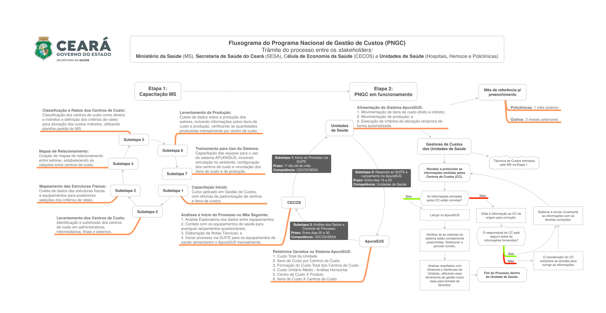

---
layout: page
show_social: true          # show site description and social links in the footer
show_excerpts: false       # show article excerpts on the home page
show_frame: true           # adds a gray frame to the site
show_sidebar: true         # show a sidebar instead of the usual header
minimal: false             # use a dark header
---

**Notas Técnicas**
- **[Indicador de Otimização dos Gastos Administrativos](https://drive.google.com/file/d/10A6spyFnkZToRCoIp4cFu-fz7o7AXjhE/view?usp=sharing)**, atualizado em 23/01/2025
- **[Judicialização da Saúde no Ceará: Impactos Orçamentários e Desafios na Aquisição de Medicamentos de Alto Custo](https://drive.google.com/file/d/10ENEk1DaYseiAlPXaugQUW4m910lmGE_/view?usp=sharing)**, atualizado em 19/12/2024
- **[Incorporação da GDI nas Aposentadorias dos Servidores da Secretaria de Saúde do Estado do Ceará e Implicações Financeiras](https://drive.google.com/file/d/1000KKS4WenqpUQZqgt1VYGU3mg8sacEA/view?usp=sharing)**, atualizado em 01/11/2024
- **[Abono de permanência e fluxo de aposentadorias: Panorama da Secretaria da Saúde do Ceará de 2024 a 2027](https://drive.google.com/file/d/1-gyHx6xYIdwXYC1_FRdZvYw38-KY-2at/view?usp=sharing)**, atualizado em 28/10/2024
- **[Desempenho das Ações de Implantação do Piso de Enfermagem do Estado do Ceará](https://drive.google.com/file/d/1-ybjd_9jriDo5xz2JdfE-eSgCfuKBEvY/view?usp=sharing)**, 15/03/2024

**Piso da Enfermagem** 
- **[Acompanhamento mensal dos repasses do Ministério da Saúde referentes ao Piso da Enfermagem, no âmbito dos equipamentos de saúde da rede SESA](https://docs.google.com/spreadsheets/d/1YTwlfRZ3aJKtyvk0xOx4lp1xXxfXIwoF/edit?usp=sharing&ouid=114592763210981187925&rtpof=true&sd=true)**, atualizado em 05/03/2025

**Programa Nacional de Gestão de Custos em Saúde**

